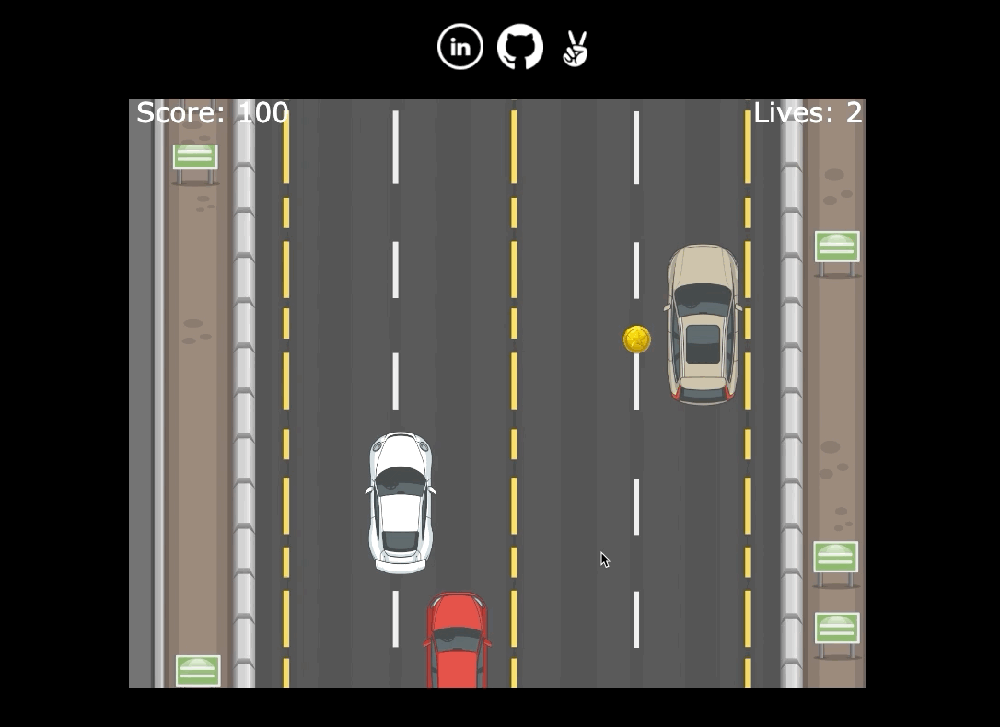

# RoadRunner
## Background & Overview
RoadRuner is a JavaScript car game in which the user drives his car around traffic collecting gold coins for extra points
## Functionality and MVPs
- **Player uses up, right, left, and down arrow keys to control the car**
- **Gold coins add 100 points to the player's score**

- **Difficulty increases as score increases**
- **Red coins will add a life**
- **Other cars will be obstacles that the player has to avoid**
- **Game continues until the player runs out of lives.**
## Architecture and Technology
- JavaScript
- Webpack
- HTML/CSS
- Canvas
## Implementation Timeline
### Day 1
- Setup git repo and development environment
- Setup canvas, and game images
### Day 2
- Start game logic
- Continuous road
- Car movement
- Obstacles
- Points
### Day 3
- Begin styling page.
### Day 4
- Sort out bugs.
- Prepare app for production.
## Bonus Features
- Boost feature (Car moves faster)